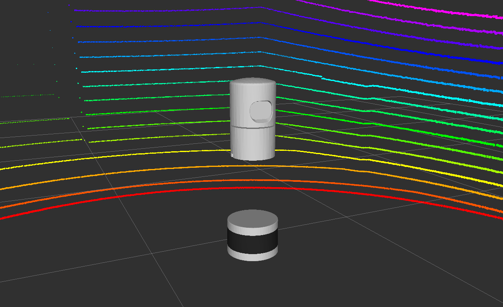

# Velodyne Simulator
URDF description and Gazebo plugins to simulate Velodyne laser scanners



# Features
* URDF with colored meshes
* Gazebo plugin based on gazebo_ros_block_laser
* Publishes PointCloud2 with same structure (x, y, z, intensity, ring)
* Simulated Gaussian noise

# Known Issues
* Gazebo cannot maintain 10Hz with large pointclouds
    * Solution: User can reduce number of points in urdf
* Gazebo versions in indigo and jade have different z orientations
    * Solution: Maintain separate branches for urdf changes

# Example Gazebo Robot
```roslaunch velodyne_description example.launch```
